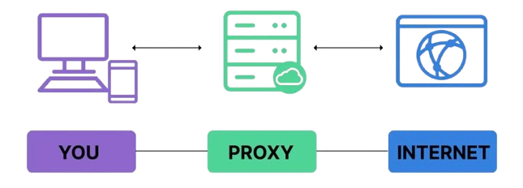

# Proxy Servers: How They Work and Why Login Is Required

## Overview

A proxy server acts as an intermediary between a client (your computer) and external network resources (websites, APIs, etc.). Clients send requests to the proxy; the proxy forwards requests to the destination, receives responses, and returns them to the client. Proxies provide privacy, content filtering, caching, logging, and policy enforcement.

## Basic request flow

1. Client → Proxy: request for resource (URL, hostname).
2. Proxy checks local policy (ACLs, cache, authentication).
3. If allowed, Proxy → Origin server: forward request (often rewriting headers).
4. Origin → Proxy: response.
5. Proxy → Client: cached or proxied response.

The above image is sourced from the article [Understanding Proxies: A Comprehensive Guide to Network Layers and Proxy Types](https://medium.com/@nwonahr/understanding-proxies-a-comprehensive-guide-to-network-layers-and-proxy-types-8f82801c6f86). If you do not understand how proxies work, please read the article before proceeding.