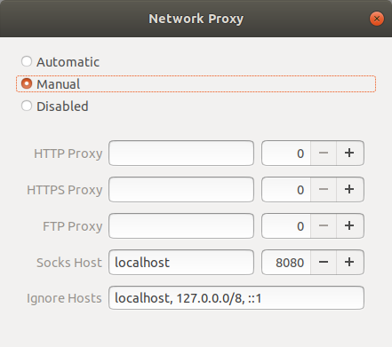

---
authors:
  - Anupam Sobti
date: 2024-03-15
---

# Living life in an SSH Session

Often, we work from multiple systems. In fact, I believe that soon people would opt for power only in their "Cloud" PCs and use remote terminals just to login and work. In this setting, knowing some of the common ways of interacting with other PCs comes in handy. This post would explain some such concepts and introduce you to a few tools that I use often.

SSH (Secure Shell) is used to create an encrypted connection between a client and a server. Anything running `openssh-server` is a potential server which you can connect using ssh.

## Setting up your PC as a server

To allow connecting other PCs to your PC, simply install `openssh-server` on your PC. Refer [Package Installation](package_installation.md) for help. If this PC is a personal PC, I would also recommend [securing it](https://www.howtogeek.com/443156/the-best-ways-to-secure-your-ssh-server).

## Working over SSH

Once you type in `ssh <username>@<hostname>` and enter your password, you should be able to get a terminal. Note that `hostname` is simply your IP Address. This connection by itself is very powerful. It gives you access to run anything on the host over the ssh connection.

Here are a few recommendations:

- Use `tmux` or `screen` to use multiple tabs and more. This also allows you to work over a flaky internet connection. Typically, a command that you've run on the host would be terminated once you close the terminal from which you launched the command (even if that is through SSH). If you would like to run a command and check back later, you should run it in `tmux` and simply `tmux attach` when you plan to resume working. (Side note: tmux also acts as a great collaborative tool but perhaps it deserves a separate post).
- Use `vncserver` if you "really" need a GUI. A quick way might also be to use `ssh -X` while logging in. This allows you to open windows directly into the host PC.

## Working from outside IIT

IITD CSE Department provides access to `sri.cse.iitd.ac.in`. This server is accessible from anywhere in the world. This allows us to access internal hosts from outside IIT and much more.

- You can access hosts inside IIT network.
- You can tunnel your internet traffic through this server allowing you to access papers and internal websites from outside. For doing this,

Use the following network proxy setting on the client:

Then login using `ssh -D8080 <username>@sri.cse.iitd.ac.in`. This allows access to eacademics and internal.iitd.ac.in portals as well as papers.

## Browsing directories remotely

- If you are still on the IITD internal network, you might want to mount a certain directory on the client PC for quick access. This can be done through `sftp://<user>@<host>` in your file browser's "Other locations" section.
- A slower but more flexible option is to use sshfs. This mounts a remote directory directly in your file system to be used as a normal directory.

`sshfs <user>@<host>:<directory_on_host_pc> <empty_directory_on_client>`.

- An even faster but limited access to directories can be by running a server on your host machine. Python provides a simple interface.
	- Go to the directory which you want to share.
	- Run `python -m SimpleHTTPServer 8000` to run the HTTP Server on the port 8000. You may now access this from your browser at `<ip_address>:8000` from anywhere within the network. Make sure you kill the server after use else your files can be used by anyone who gets access to the same. You will have to use `python3 -m http.server` if you only have python3.

## Running code remotely

- I like to use vim for most of my coding and debugging. So it's not a problem for me since I just work over the terminal.
- If you like to use jupyter, make sure you launch your notebook with `jupyter notebook --ip 0.0.0.0 --no-browser` to allow access from a different PC. You will be shown a token on the screen for authorization.
